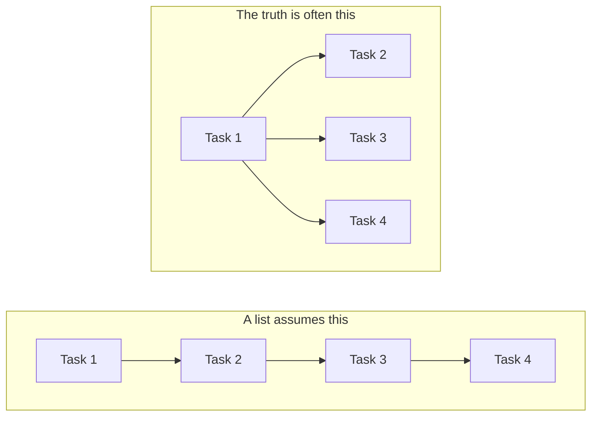
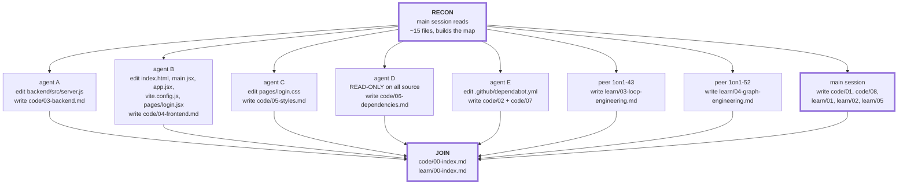
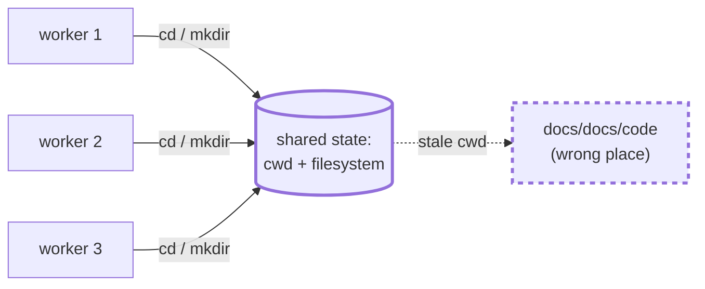
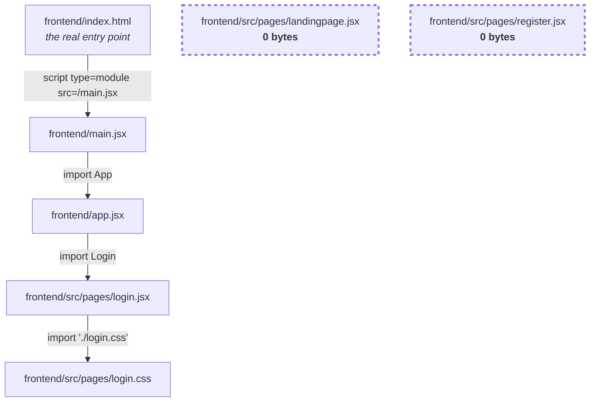
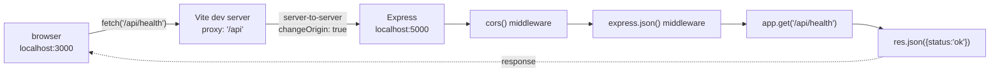
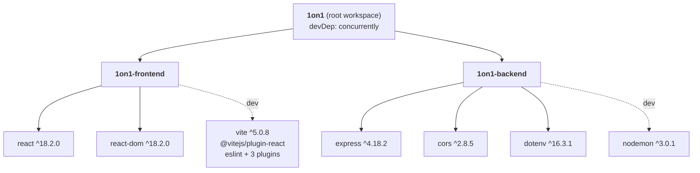
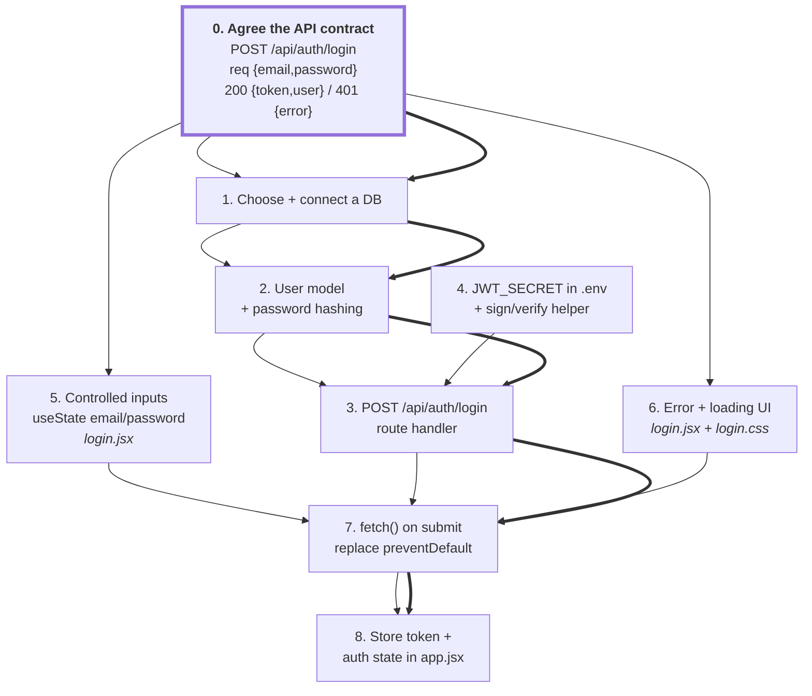

# Graph Engineering — turning work into a shape you can execute

> **The one-sentence version:** a list tells you *what* to do; a graph tells you
> what can happen **at the same time**, what must **wait**, and which single chain
> decides how long the whole thing takes.

Prompt engineering is what you *say*. Context engineering is what I can *see*.
Loop engineering is how we *iterate*. Graph engineering is how the work is
**shaped** — and it is the one that decides whether eight agents finish in one
wave or trip over each other for an hour.

This doc teaches three things that share one name:

| | Sense of "graph engineering" | Where it pays off |
|---|---|---|
| **A** | Modelling **work** as a dependency graph | Planning any multi-step task, especially with parallel agents |
| **B** | The **worked example** — this exact documentation session, as a real DAG | Seeing the theory actually applied, including the bug it caused |
| **C** | Using graphs to **understand a codebase** | Spotting dead code, cycles and god-modules in seconds |

Plus the mechanics: writing these diagrams in Markdown so they live in the repo.

---

## Part A — Work is a graph, not a list

### A1. Nodes and edges

- **Node** = a unit of work. "Comment `backend/src/server.js`". "Write `docs/code/03-backend.md`".
- **Edge** = a dependency. `A --> B` means **A must finish before B can start**.

That is the *whole* model. The discipline is in being honest about the edges.

A to-do list is secretly a graph where someone has already drawn an edge between
every consecutive pair — a single straight line. Most of those edges are fake.
Deleting the fake ones is where all the speed comes from.



Left: 4 time units. Right: 2. Same work, different shape.

### A2. Why it must be a DAG

**DAG** = Directed Acyclic Graph. *Directed* = edges have arrows. *Acyclic* = no cycles.

A cycle means A waits for B and B waits for A. Nothing can start. Not "slow" —
**impossible**. So:

> If your plan has a cycle, it is not a plan. It is a deadlock with optimism attached.

Cycles in a work plan are almost always a sign that two nodes are really *one*
node that you split at the wrong seam. The fix is to merge them, or to find the
smaller thing that genuinely comes first (usually: "agree the interface").

### A3. Topological sort, and levels

A **topological sort** is any ordering of nodes where every node appears after
all of its dependencies. A DAG always has at least one. That is the payoff of
being acyclic: *an executable order is guaranteed to exist.*

But you don't want *an* order — you want the **levels** (also called waves):

- **Level 0** = every node with no incoming edges. All of these can start now.
- **Level N** = nodes whose dependencies are all in levels `< N`.

Everything in one level runs in parallel. The number of levels is your wall-clock
cost; the width of a level is how much parallelism you can actually use.

```
Level 0:  [recon]                                  <- 1 wide,  everything waits
Level 1:  [A][B][C][D][E][F][G][H]                 <- 8 wide,  all at once
Level 2:  [index]                                  <- 1 wide,  waits for all of L1
          |---- wall clock = L0 + max(L1) + L2 ----|
```

### A4. The critical path — the number that actually matters

The **critical path** is the longest chain of dependencies from start to finish.

> **No amount of parallelism beats the critical path.** You can throw 100 agents
> at a job and it will still take as long as its longest chain.

This is the single most useful idea in this document. When something is taking too
long, the question is never "can I add more workers?" — it is **"what is on the
critical path, and can I shorten or break that chain?"**

Three legitimate ways to attack a critical path, in order of usefulness:

1. **Cut a fake edge.** Does `C` *really* need `B`, or just one fact from `B`?
   Extract that fact into a tiny node and both can proceed. (See §7 — the API
   contract trick.)
2. **Shrink the longest node.** Split the slow node into two that can run in parallel.
3. **Start it earlier.** If a long node has no dependencies, it should be in Level 0.

Adding workers to nodes that are *not* on the critical path does nothing at all.
It looks busy. It is theatre.

### A5. Fan-out and fan-in

- **Fan-out**: one node, many successors. This is where parallelism is born.
- **Fan-in**: many nodes, one successor. This is a **join** — it cannot start until
  the *slowest* input finishes.

Joins are where parallel plans go to die. A join is a synchronisation barrier: 7 of
your 8 agents can be done, and the join still waits for the 8th. So:

> Push joins as late as possible, and keep them as small as possible.

An index page that links to every other doc is a pure join node. It has to be last.
Fine — just make sure it's *cheap*, so the barrier costs you seconds, not minutes.

### A6. The rule that actually matters for AI agents: partition by **write ownership**

Everything above is classic scheduling theory. Here is the part specific to running
several agents (or several sessions, or several people) at once:

> **The only real edge between two agents is a shared write.**

| Relationship | Safe to parallelise? | Why |
|---|---|---|
| Both **read** the same file | ✅ Always | Reads don't conflict. Ever. |
| One writes, another reads it | ⚠️ Only with an edge | The reader must run *after*, or it reads a stale file |
| Both **write** the same file | ❌ Never | Last writer wins. The other agent's work is silently gone |

Two agents editing the same file is not a merge conflict — there is no VCS in the
middle. It is a **lost write**. Agent B reads the file, agent A saves, agent B
saves its (pre-A) version, and A's work has vanished with no error anywhere.

So the practical planning algorithm is:

1. List every **file** the job will modify.
2. Assign each file to **exactly one** owner.
3. Any two workers with **disjoint** write sets can run in the same wave.
4. Anything that must touch a shared file becomes its own node, on an edge.

That is it. That's the whole partitioning strategy, and it is why the session
below could safely run eight workers at once.

### A7. Amdahl's law, without the algebra

> Your speedup is capped by the fraction of the work that **cannot** be parallelised.

If 20% of a job is inherently serial, then even with infinite workers you can never
be more than **5×** faster. With 50% serial, never more than 2×.

The practical reading: **shrinking the serial part is worth more than adding
workers.** Recon, planning, and the final join are usually the serial part. If
they're half your job, buying more agents buys you almost nothing.

---

## Part B — The worked example: this documentation session

Everything above was applied, for real, to produce the docs you are reading.
Here is the actual graph.

### B1. The graph



### B2. Reading it

| Level | Width | Kind | Why it is that shape |
|---|---|---|---|
| **0 — Recon** | 1 | Serial, blocking | **You cannot partition work you have not surveyed.** To assign disjoint file sets, you must first know which files exist. This node is unparallelisable *by definition*. |
| **1 — Fan-out** | 8 | Parallel | Every worker owns a **disjoint write set**. All eight read freely from the same source tree — reads are free (§A6). |
| **2 — Join** | 1 | Serial | The index files **link to every other doc**. They cannot be written until the filenames and headings they link to exist. A pure fan-in. |

Note agent **D** in particular: it is **read-only** on all source. Its write set is
one file nobody else touches. Read-only workers are the easiest possible thing to
parallelise — they can never conflict with anyone.

### B3. The critical path

Using rough relative units (these are illustrative, not measured):

```
recon        ████                              4
             |
level 1      ████████████  agent A (largest source file)   12   <- the max
             ██████        agent B                          6
             ████          agent C                          4
             ██████        main session (5 docs)            6
             ...
             |
join         ██                                             2

critical path = 4 + 12 + 2 = 18
serial total  = 4 + (12+6+4+4+5+5+6+6) + 2 = 54
```

Roughly a **3× speedup** — not 8×, despite 8 workers. That gap *is* Amdahl's law:
6 of the 18 units (recon + join) are irreducibly serial, and inside the parallel
wave the slowest single agent sets the pace, not the average.

**The lesson to take:** the way to make this faster was never "spawn more agents".
It was to split the largest node (agent A's file was the biggest) or to shrink recon.

### B4. The bug — the edge nobody drew

Something actually went wrong during this session, and it is the best teaching
material in the whole document.

A `mkdir` command ran with a **stale working directory**. Instead of creating
`docs/code/` and `docs/learn/` at the repo root, it created stray empty
directories at `docs/docs/code` and `docs/docs/learn`. A subagent noticed the
anomaly, reported it, and the main session cleaned it up.

Why did the graph not prevent this? Because the graph modelled the edges we were
*thinking* about — file writes — and missed one:

> **The filesystem and the working directory are shared mutable state.**
> They are a node in the graph whether you draw them or not.



The generalisable rule, and it is worth memorising:

> When you partition by write ownership, remember that **directory creation,
> `cd`, environment variables, a dev server's port, and the git index** are all
> writes too — to state that every worker shares.

Two defences, both cheap:

1. **Use absolute paths.** A path that does not depend on cwd cannot be broken by
   a stale cwd. This is the same reason `backend/src/server.js` builds its `.env`
   path from `__dirname` rather than `process.cwd()` — see the comments in that
   file. Same bug class, already solved once in this repo.
2. **Make shared-state mutations their own node**, owned by one worker, before the
   fan-out. Create all directories in Level 0.

---

## Part C — Graphs for reading a codebase

Same tool, pointed at the code instead of the plan. Three graphs of **this** repo.

### C1. The module / render graph



Look at `landingpage.jsx` and `register.jsx`. **No inbound edges.** Nothing imports
them, and they are empty files.

That is the selling point of graph thinking, in one picture:

> In a file listing, a dead file looks exactly like a live one.
> In a graph, it is instantly, visually obvious — it's the node floating on its own.

Also note the chain is **linear and 5 deep**. Every screen in this app must currently
pass through `app.jsx`, which is a bare pass-through wrapper. That's fine at one
screen; it's the exact node that becomes the router when there are three.

### C2. The runtime request graph



Two things this graph makes obvious that prose hides:

- The browser only ever talks to **one origin** (`:3000`). The hop to `:5000` happens
  in Node. That is why there is no CORS problem in dev — and why `cors()` is
  currently redundant for proxied traffic.
- The middleware chain is **ordered**. `cors()` then `express.json()` then the route.
  Those edges are not decoration; registering the route first would mean it never
  sees the parsed body. **Order is behaviour.**

### C3. The workspace / dependency graph



Solid = ships at runtime. Dashed = build/dev only, never reaches a user.
That distinction is *hard* to see in a `package.json` and *trivial* to see here.

### C4. What to look for in any code graph

| Pattern | What it looks like | What it usually means |
|---|---|---|
| **Orphan node** | No inbound edges | Dead code, or something half-built. `landingpage.jsx`, `register.jsx`. |
| **Cycle** | A → B → A | Circular import. Fragile init order, hard to test, hard to delete anything. |
| **God node** | Very high inbound degree | One module everyone depends on. Every change is risky; it's the bottleneck for both bugs *and* parallel work. |
| **Long chain** | Deep linear path | Change propagation is slow; a bug anywhere in the chain breaks the end. Also: it's a critical path. |
| **Bridge node** | Removing it disconnects the graph | Your true single point of failure. Here: `app.jsx`. |

---

## Part D — Mermaid in Markdown (the mechanics)

GitHub renders ` ```mermaid ` fenced blocks **natively**. No plugin, no image, no
external service. Write the text, commit it, and the diagram appears in the README,
the PR, and the file view.

### Why a graph in `.md` beats a drawing tool

| | Mermaid in Markdown | Figma / Excalidraw / a PNG |
|---|---|---|
| **Diffable** | ✅ `git diff` shows exactly which edge changed | ❌ binary blob, "image changed" |
| **Reviewable in a PR** | ✅ comment on the line that adds the edge | ❌ screenshot in a comment |
| **Versions with the code** | ✅ same commit, same branch | ❌ drifts immediately |
| **Editable by an agent** | ✅ it's text | ❌ it isn't |
| **Needs an account/service** | ✅ no | ❌ usually |
| **Pixel-perfect layout control** | ❌ no | ✅ yes |

The last row is the only one you lose, and for architecture diagrams you should not
want it. Auto-layout means the diagram never rots into a hand-tuned mess.

### Cheatsheet

| Want | Syntax |
|---|---|
| Top-down graph | `graph TD` |
| Left-right graph | `graph LR` |
| Plain node | `A[Square label]` |
| Rounded | `A(Rounded)` |
| Decision / diamond | `A{Is it valid?}` |
| Database / cylinder | `A[(Postgres)]` |
| Circle | `A((Start))` |
| Plain arrow | `A --> B` |
| Labelled arrow | `A -->|POST /login| B` |
| Dotted (weak/optional) | `A -.-> B` |
| Thick (critical path) | `A ==> B` |
| No arrowhead | `A --- B` |
| Group | `subgraph NAME ... end` |
| Emphasis | `style A stroke-width:4px` |
| Line break in a label | `A["line one<br/>line two"]` |

Two gotchas that cost people ten minutes each:

- **Quote any label containing `(`, `)`, `:` or `,`** — `A["fetch('/api')"]`, not `A[fetch('/api')]`.
- **Prefer `stroke` over `fill` for emphasis.** A hardcoded light `fill` becomes
  unreadable in GitHub's dark theme. Stroke width and dashes work in both.

### When NOT to draw a graph

Be honest about this, or your docs fill with noise:

- **Fewer than ~4 nodes.** A sentence is clearer.
- **A purely linear sequence.** Steps 1→2→3→4 is a numbered list, not a diagram.
  Diagrams earn their place when there is **branching, joining, or a cycle**.
- **When you'd have to invent the relationships.** A graph asserts that the edges
  are real. If you're guessing, you're documenting a guess with extra confidence.

> Rule of thumb: **draw the graph when the interesting information is in the edges.**
> If all the information is in the nodes, write a list.

---

## Part E — Recipe: derive the graph for your next feature

Applied to this repo's actual next task: **wire the login form to the backend.**

Right now `login.jsx` has `useState` for `isLogin` and `showPassword`, and its form
does `onSubmit={(e) => e.preventDefault()}` — it submits nothing, to nowhere. The
backend has exactly one route, `GET /api/health`. So this is a real, unstarted job.

### The 5-step recipe

1. **List the nodes.** Every distinct deliverable. Be concrete — "auth" is not a node,
   "issue a JWT on successful login" is.
2. **For each pair, ask: does B *truly* need A finished?** Not "does it feel later" —
   *need*. Most edges evaporate under this question.
3. **Mark the write set of each node.** Which files does it touch? Disjoint sets =
   parallelisable.
4. **Find the longest chain.** That's your ETA. Everything else is slack.
5. **Attack the chain, not the node count.** Can you cut an edge by agreeing an
   interface up front?

### The graph



**Thick edges = the critical path:** contract → DB → User model → route → fetch →
auth state. That chain is your true minimum. Nodes **4, 5 and 6** hang off to the
side — they are slack, and they can be done by someone else, in parallel, or while
you wait.

### Write-ownership check

| Node | Files written | Conflicts with |
|---|---|---|
| 1–3 (DB, model, route) | `backend/src/**` | nothing on the frontend |
| 4 (JWT) | `.env`, `backend/src/**` | node 3 — **same directory, sequence them** |
| 5 (controlled inputs) | `frontend/src/pages/login.jsx` | node 6, node 7 |
| 6 (error UI) | `login.jsx` + `login.css` | node 5 — **same file, sequence them** |
| 7 (fetch) | `login.jsx` | nodes 5, 6 |

So the honest parallel split here is **two lanes: backend and frontend.** Not eight.
Everything in the frontend lane writes `login.jsx`, so it serialises whether you
like it or not. Recognising that *before* you start is the entire point.

### The most valuable move on this graph

Node 0 — **agree the API contract first** — is not real work. It's a paragraph in
a doc. But look what it does: without it, node 6 (error UI) depends on node 3
(the route being finished, so you know what an error looks like). With it, node 6
depends only on the *contract*, and moves off the critical path entirely.

> **Cutting one fake edge with a 5-minute agreement beat adding a whole worker.**

That is graph engineering.

---

## The short version

1. Work is a **DAG**, not a list. Most edges in your mental list are fake.
2. **No cycles**, or nothing can start.
3. The **critical path** is your real ETA. More workers do not shorten it.
4. Partition parallel work by **write ownership**. Shared reads are free; shared
   writes are the only true edge — and the filesystem, cwd and env are writes too.
5. **Amdahl**: shrink the serial part (recon, joins) before you add workers.
6. Fan-in **joins** wait for the slowest input. Keep them late and cheap.
7. In a codebase graph, hunt for **orphans, cycles, god-nodes and long chains**.
8. Draw it in **mermaid, in Markdown** — diffable, reviewable, versioned with the code.
9. Don't draw one for fewer than 4 nodes or a straight line.
10. To go faster, **cut an edge** — usually by agreeing an interface up front.

---

**Related:** [`01-prompt-engineering.md`](01-prompt-engineering.md) ·
[`02-context-engineering.md`](02-context-engineering.md) ·
[`03-loop-engineering.md`](03-loop-engineering.md) ·
[`../code/01-repo-anatomy.md`](../code/01-repo-anatomy.md)

**Next:** [`05-your-prompt-rewritten.md`](05-your-prompt-rewritten.md) — all four
disciplines applied at once, rewriting your original prompt into one a senior dev
would send.
